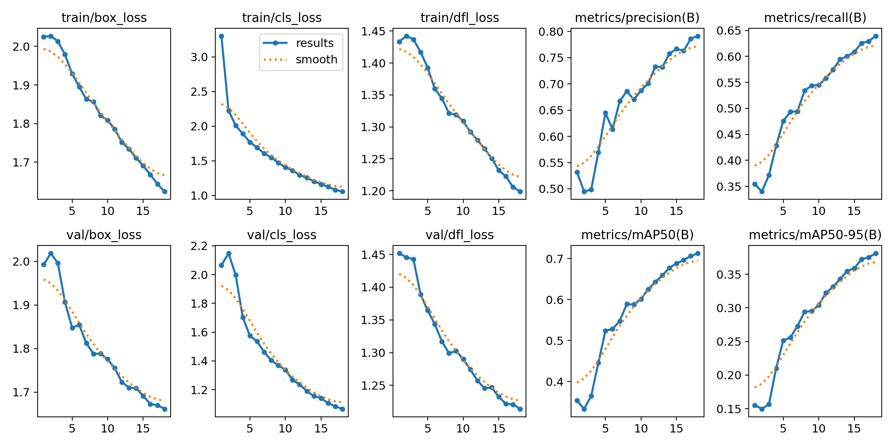
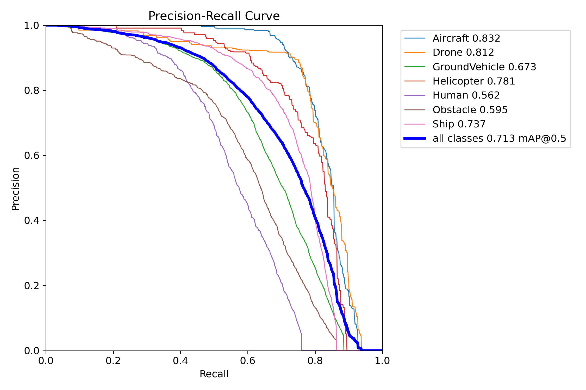
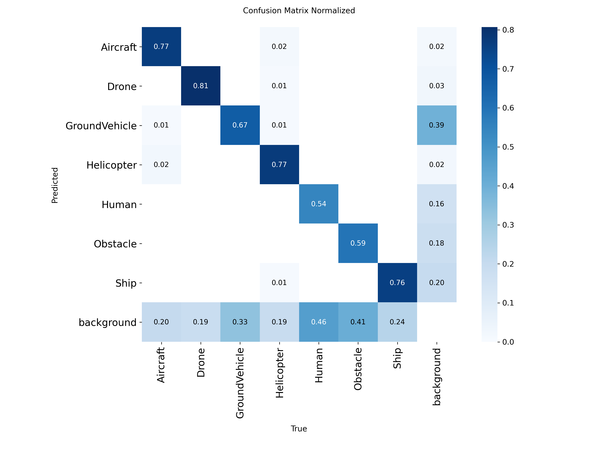
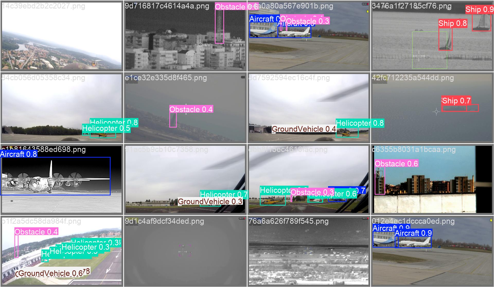

# Improved Run vs Baseline

## Overall metric comparison
These baseline numbers are the ones already used in the first report version. The improved numbers come from the completed `leonardo_improved-4` run.

| Run | Precision | Recall | mAP50 | mAP50-95 |
|---|---:|---:|---:|---:|
| Baseline `yolo11n`, 960 px | `0.790` | `0.642` | `0.715` | `0.382` |
| Improved `yolo11s`, 1280 px, oversampling | `0.836` | `0.715` | `0.792` | `0.439` |
| Absolute gain | `+0.046` | `+0.073` | `+0.077` | `+0.057` |

## Relative interpretation

| Metric | Baseline | Improved | Relative gain |
|---|---:|---:|---:|
| Precision | `0.790` | `0.836` | about `+5.8%` |
| Recall | `0.642` | `0.715` | about `+11.4%` |
| mAP50 | `0.715` | `0.792` | about `+10.8%` |
| mAP50-95 | `0.382` | `0.439` | about `+15.0%` |

The recall and mAP50-95 gains matter the most for this project. Recall measures whether the detector finds more objects, and mAP50-95 is stricter about localization quality than mAP50 alone. Both are directly related to the baseline weakness: small objects were often missed or localized poorly.

## Training curve comparison

Baseline training curves:

Improved training curves:

Observations:
- The baseline improves smoothly but ends with recall around `0.642` and mAP50-95 around `0.382`.
- The improved run keeps improving until the final epoch and ends higher on every main metric.
- The improved run is slower, but the extra compute buys a real gain rather than just a marginal change.

## PR curve comparison

Baseline precision-recall curve:

Improved precision-recall curve:

Observations:
- The improved curve should be used in the updated report because it represents the final model.
- The baseline already detected clear examples well, but the improved run gives a better precision-recall tradeoff overall.
- The improvement is consistent with the higher recall and mAP50 values in the metric table.

## Confusion matrix comparison

Baseline normalized confusion matrix:

Improved normalized confusion matrix:

Observations:
- The main error pattern remains background misses, which is expected for tiny objects.
- The improved run reduces the overall missed-object problem, but it does not remove it completely.
- The conclusion should not be that the problem is solved perfectly. A better conclusion is that higher resolution and oversampling improved the most important failure mode.

## Validation example comparison

Baseline predictions:

Improved predictions:

Improved ground truth for the same saved batch:

Visual takeaways:
- Clear objects remain easy for both models.
- The improved run is more useful for crowded and small-object scenes because it was trained at higher resolution and with a higher `max_det`.
- Some false negatives and duplicate detections are still expected in dense scenes.

## What should change in the report
- Replace the old line saying the improved run is still ongoing.
- Add a new results table with both baseline and improved metrics.
- Add the improved `results.png`, `BoxPR_curve.png`, and `confusion_matrix_normalized.png`.
- Explain that the improved run mainly helped recall and localization quality.
- Keep the limitation section: tiny objects, dense scenes, and background misses are still the main weaknesses.
