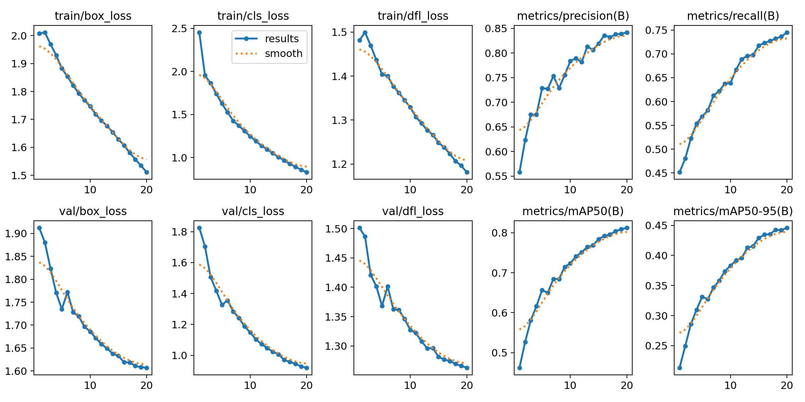
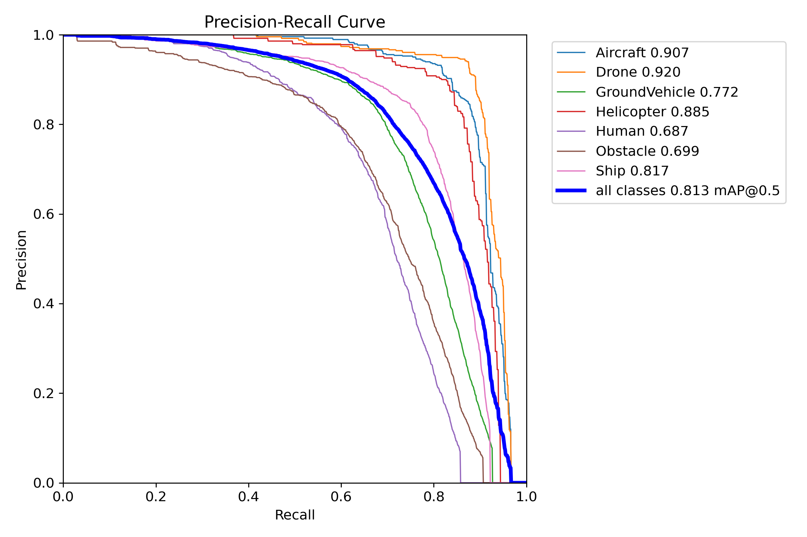
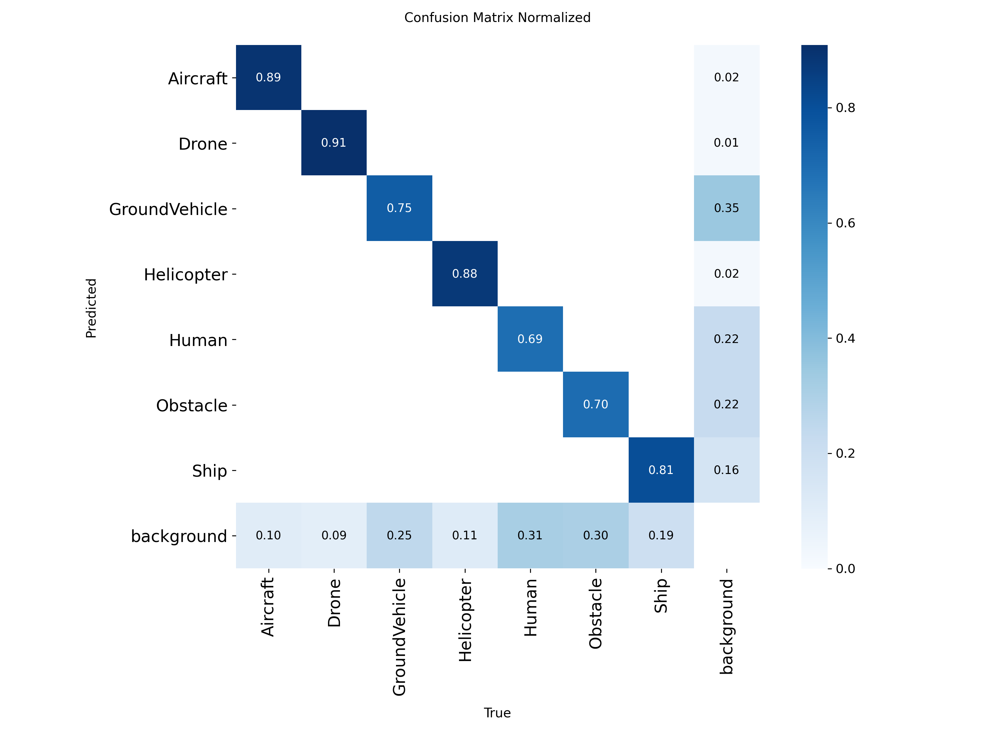
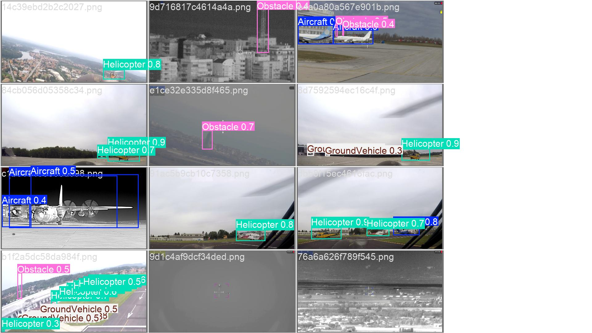
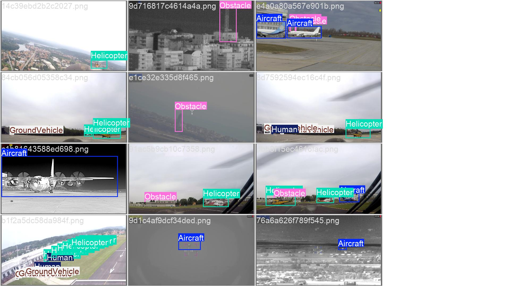

# Small/Dense Specialist Results

## Context

This folder contains the results of the final small/dense specialist experiment.

The motivation was to test a controlled version of the teacher's suggestion about training different detectors for different object types or object scales. Instead of training seven separate one-class YOLO models, this experiment keeps a single multi-class YOLO detector and changes the training sampler so the model sees difficult small-object and dense-scene examples more often.

Final run:

```text
runs/detect/leonardo_B_small_dense_x2_yolo11s
```

Final checkpoint:

```text
runs/detect/leonardo_B_small_dense_x2_yolo11s/weights/best.pt
```

## What Changed

The model architecture stayed the same as the improved run:

```text
YOLO11s, 1280 image size, 20 epochs
```

The main difference is the training data sampling strategy.

The previous improved run used rare-class oversampling. This experiment extends that idea by also repeating images that contain small objects or dense object layouts. The goal was to improve recall on the remaining hard cases: tiny objects, crowded scenes, and background misses.

Training data used:

```text
processed/data_small_dense.yaml
```

This file points to a repeated-image train list:

```text
processed/meta/train_small_dense_x2_rare_x2.txt
```

The final training list contains:

```text
21964 image entries
```

The original train split contains:

```text
14145 unique images
```

## Final Result

Validation used the same original validation split as the previous experiments:

```text
processed/data.yaml
processed/images/val
processed/labels/val
```

Final validation metrics:

| Run | Precision | Recall | mAP50 | mAP50-95 |
|---|---:|---:|---:|---:|
| Small/dense specialist YOLO11s | `0.845` | `0.746` | `0.814` | `0.447` |

Training time:

```text
15.773 hours
```

## Comparison With Previous Results

The previous report included the YOLO11n baseline. The improved YOLO11s reference run was completed later and became the main result to beat.

| Run | Main Change | Precision | Recall | mAP50 | mAP50-95 |
|---|---|---:|---:|---:|---:|
| Previous report baseline | YOLO11n, 960 px | `0.790` | `0.642` | `0.715` | `0.382` |
| Improved reference | YOLO11s, 1280 px, rare-class oversampling | `0.8355` | `0.7153` | `0.7924` | `0.4392` |
| Small/dense specialist | YOLO11s, 1280 px, small/dense sampling | `0.845` | `0.746` | `0.814` | `0.447` |

## Threshold Tuning Check

After the small/dense run, the improved reference checkpoint was also evaluated with a small confidence/NMS/max-det grid. This tested whether the previous improved model could be recovered through post-processing alone.

Best setting by mAP50-95:

| Weights | conf | IoU | max_det | Precision | Recall | mAP50 | mAP50-95 |
|---|---:|---:|---:|---:|---:|---:|---:|
| Improved reference | `0.001` | `0.70` | `1000` | `0.8372` | `0.7164` | `0.7935` | `0.4401` |

Best setting by recall:

| Weights | conf | IoU | max_det | Precision | Recall | mAP50 | mAP50-95 |
|---|---:|---:|---:|---:|---:|---:|---:|
| Improved reference | `0.001` | `0.55` | `600` | `0.8422` | `0.7405` | `0.8043` | `0.4371` |

The threshold tuning improved the reference model slightly, especially for recall under the lower-IoU setting, but it still did not outperform the small/dense specialist. The small/dense model remains the strongest result overall: `0.845` precision, `0.746` recall, `0.814` mAP50, and `0.447` mAP50-95.

Absolute gain over the previous report baseline:

| Metric | Gain |
|---|---:|
| Precision | `+0.055` |
| Recall | `+0.104` |
| mAP50 | `+0.099` |
| mAP50-95 | `+0.065` |

Absolute gain over the improved reference:

| Metric | Gain |
|---|---:|
| Precision | `+0.0095` |
| Recall | `+0.0307` |
| mAP50 | `+0.0216` |
| mAP50-95 | `+0.0078` |

The most important improvement is recall. This matches the purpose of the experiment: the small/dense sampling strategy was meant to help the detector find more objects in difficult scenes.

## Per-Class Metrics

| Class | Images | Instances | Precision | Recall | mAP50 | mAP50-95 |
|---|---:|---:|---:|---:|---:|---:|
| Aircraft | `288` | `452` | `0.871` | `0.853` | `0.906` | `0.588` |
| Drone | `482` | `482` | `0.930` | `0.881` | `0.925` | `0.426` |
| GroundVehicle | `854` | `4816` | `0.814` | `0.688` | `0.774` | `0.404` |
| Helicopter | `234` | `283` | `0.875` | `0.830` | `0.882` | `0.606` |
| Human | `693` | `2733` | `0.797` | `0.601` | `0.688` | `0.337` |
| Obstacle | `854` | `2660` | `0.779` | `0.621` | `0.703` | `0.329` |
| Ship | `999` | `2691` | `0.847` | `0.749` | `0.817` | `0.436` |

`Human` and `Obstacle` remain the hardest classes, but the global recall increase suggests that the model found more objects overall, especially in difficult scenes.

## Included Figures

Training curves:



Precision-recall curve:



Normalized confusion matrix:



Validation prediction example:



Ground truth for the same batch:



## Folder Contents

Metrics:

```text
metrics/overall_comparison.csv
metrics/per_class_validation_metrics.csv
metrics/small_dense_training_summary.json
metrics/improved_reference_threshold_summary.json
metrics/improved_reference_threshold_grid.csv
metrics/threshold_tuning_comparison.csv
metrics/training_results.csv
metrics/train_args.yaml
metrics/specialist_summary.json
metrics/specialist_image_stats.csv
```

Figures:

```text
images/results.png
images/BoxPR_curve.png
images/BoxF1_curve.png
images/BoxP_curve.png
images/BoxR_curve.png
images/confusion_matrix.png
images/confusion_matrix_normalized.png
images/val_batch*_pred.jpg
images/val_batch*_labels.jpg
images/train_batch*.jpg
```

## Short Report Wording

For the final stage, we tested a small/dense specialist training strategy. The detector architecture stayed the same as the improved YOLO11s model, but the training list was changed so images containing small objects or dense layouts appeared more often. This directly targeted the main failure mode observed in the baseline: missed detections for tiny or crowded objects. Compared with the improved reference, the specialist model increased precision from `0.8355` to `0.845`, recall from `0.7153` to `0.746`, mAP50 from `0.7924` to `0.814`, and mAP50-95 from `0.4392` to `0.447`.

## Conclusion

The small/dense specialist experiment is a successful final improvement. It improves all four main validation metrics over the improved reference while keeping the system simple: one YOLO11s detector, the same validation split, and a modified sampling strategy focused on the dataset's hardest cases.
